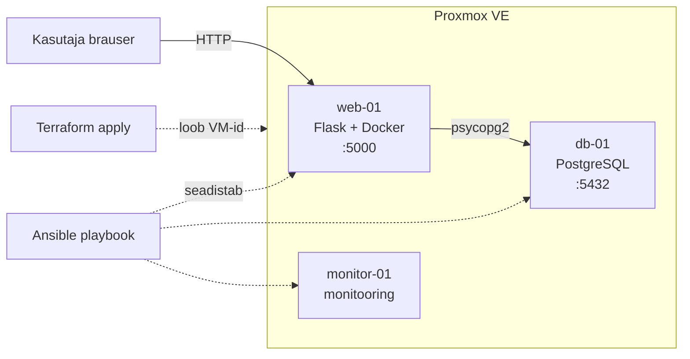

# RAK lõpprojekt

Automatiseeritud Flask veebirakenduse paigaldus Proxmox keskkonnas. Kasutatud tööriistad: **Terraform**, **Ansible**, **Docker**.

## Arhitektuur



| VM | IP (näide) | Roll |
|----|------------|------|
| web-01 | 10.0.1.11 | Flask rakendus Docker konteineris |
| db-01 | 10.0.1.12 | PostgreSQL andmebaas |
| monitor-01 | 10.0.1.13 | Süsteemi monitooringu tööriistad |

Rakendus võimaldab kasutajal jätta sõnumi (kasutajanimi + tekst). Andmed salvestatakse PostgreSQL tabelisse `messages`.

## Repo struktuur

```text
task/                          Flask, Dockerfile, docker-compose
terraform-cloud-init-2204/     Proxmox VM loomine
ansible/                       VM-de seadistamine (site.yml)
```

## Eeldused

- Proxmox API ligipääs (URL, token)
- Ubuntu 24.04 cloud-init template Proxmoxis
- Paigaldatud: Git, Terraform, Ansible, SSH võti
- Kliendi masin samas võrgus mis Proxmox (või VPN)

## Paigaldusjuhend

### 1. Reposiitorium

```bash
git clone https://github.com/paluveerandris-dot/rak-lopprojekt.git
cd rak-lopprojekt
```

### 2. Kohalik test (valikuline)

Enne labi saab rakendust testida ühel masinal:

```bash
cd task
docker compose up -d
```

Ava brauser: `http://localhost:5000` — kontrolli sõnumi salvestust.

Peatamine: `docker compose down`

### 3. Terraform — virtuaalmasinate loomine

```bash
cd terraform-cloud-init-2204
cp terraform.tfvars.example terraform.tfvars
```

Täida `terraform.tfvars` (Proxmox API, template, storage, IP-d, SSH avalik võti).

```bash
terraform init
terraform plan
terraform apply
```

Kontrolli Proxmoxi veebiliideses, et tekkinud on `web-01`, `db-01`, `monitor-01`.

### 4. Ansible — seadistamine

Uuenda IP-aadressid failides `ansible/inventory` ja `ansible/host_vars/` kui need erinevad Terraformi omadest.

```bash
cd ../ansible
ansible all -i inventory -m ping
ansible-playbook -i inventory site.yml
```

Playbook teeb:
- **web-01** — Docker, rakenduse failid, `docker compose` (Flask)
- **db-01** — PostgreSQL konteiner, tulemüür (port 5432 ainult web-01-lt)
- **monitor-01** — htop, net-tools, sysstat

### 5. Rakenduse kontroll

Ava brauser: `http://10.0.1.11:5000` (või sinu web-01 IP).

1. Sisesta kasutajanimi ja sõnum  
2. Kontrolli, et sõnum kuvatakse lehel  
3. `docker ps` masinal web-01 ja db-01

### 6. Infrastruktuuri eemaldamine

```bash
cd terraform-cloud-init-2204
terraform destroy
```

## Tööriistad

| Tööriist | Versioon / märkus |
|----------|-------------------|
| Terraform | >= 1.x, provider Telmate/proxmox |
| Ansible | 2.x |
| Docker | Engine + Compose plugin |
| Python | 3.12 (konteineris) |
